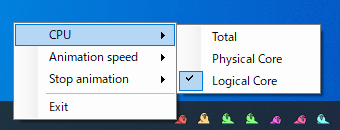

PPCpuMon
====

Party Parrot のCPUモニタです。

## Description

タスクバーアイコンを右クリックするとメニューが表示されます。

#### CPU

CPUの表示方法を選択します。

* Total：全てのコアを1つのアイコンで表示
* Physical Core：物理コアごとに表示
* Logical Core：論理コアごとに表示

Physical Core を選択した場合は、物理コアのすべてのコアの平均値となります。

#### Animation speed

アニメーションの速度を設定します。

#### Stop animation

CPU使用率が設定値以下になったときにアニメーションを停止します。
「None」を選択した場合は停止しません。

#### Exit

アプリケーションを終了します。

## Requirement

* Microsoft Windows 7 以降
* Microsoft .net Framework 3.6 以降

## Install

[PortPopInstaller.msi](https://github.com/tomozh/PPCpuMon/blob/master/PPCpuMonInstaller/Release/PPCpuMonInstaller.msi) を実行してインストール、または、[PPCpuMonInstaller.exe](https://github.com/tomozh/PPCpuMon/blob/master/bin/Release/PPCpuMon.exe) を、適当なフォルダに入れて実行して下さい。

実行後は、タスクトレイに常駐します。

インストーラでインストールした場合は、スタートアップへ自動的に登録されます。(ログオン時に自動起動します)

## Licence

[MIT](https://opensource.org/licenses/mit-license.php)

## Author

[tomozh](http://ore-kb.net)
